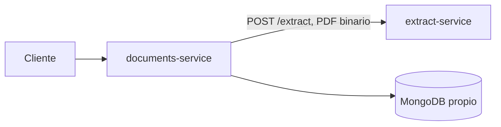

# documents-service

Microservicio de **persistencia de documentos PDF ya procesados**. Guarda, consulta y borra documentos, evita duplicados por checksum SHA-256 y orquesta la extracción de texto delegándola en `extract-service`.

Es el segundo microservicio del TP de *Test de Carga, Estrés y Optimización de Microservicio* (UTN FRSR). El primero — `extract-service`, el que se mide con k6 y Vegeta — vive en [`pdf_extractext`](https://github.com/juandelosrios124/pdf_extractext).

## Qué hace y qué no

**Hace:** guardar, consultar y borrar documentos; deduplicar por checksum; orquestar la extracción con resiliencia (circuit breaker, bulkhead, timeout y un reintento acotado).

**No hace:** extraer texto (eso es de `extract-service`), autenticar usuarios, resumir ni traducir. Tampoco agrega endpoints ni dependencias a `extract-service`: la ruta que se mide en el TP queda intacta.

## Por qué existe

`extract-service` se satura bajo carga — en las mediciones del repo hermano, 40,8 % de éxito y P95 de 30 s con Vegeta a 50 req/s. Alguien tiene que reaccionar bien a eso: fallar rápido, no reintentar a ciegas y seguir sirviendo lecturas mientras el extractor está caído. Ese es el trabajo de este servicio, y es lo que convierte los patrones del apunte en código real.

## Arquitectura



Capas, de afuera hacia adentro:

```
app/api/            HTTP: routers, DTOs y providers de dependencias
app/services/       casos de uso + patrones de resiliencia
app/repositories/   adaptador de MongoDB
app/ports.py        Protocol: lo único que la capa de servicios conoce
```

La capa de servicios depende de `Protocol`, nunca de Motor ni de httpx. Eso es lo que permite que toda la suite —incluido el test de resiliencia del criterio de aceptación— corra sin MongoDB, sin `extract-service` y sin red.

## Contrato

| Método | Ruta | Descripción | Respuestas |
|---|---|---|---|
| `POST` | `/documents` | Recibe un PDF (`multipart/form-data`, campo `file`), calcula el SHA-256 y, si no existe, llama a `extract-service` y guarda el resultado | `201` nuevo · `200` duplicado (`"duplicate": true`) · `400` vacío o no PDF · `413` demasiado grande · `502` respuesta inválida de extract · `503` + `Retry-After` si extract no está disponible o no hay cupo · `504` timeout |
| `GET` | `/documents/{id}` | Documento completo, con `content` | `200` · `404` |
| `GET` | `/documents?limit=&offset=` | Listado **sin** `content` | `200` |
| `DELETE` | `/documents/{id}` | Borra | `204` · `404` |
| `GET` | `/health` | Liveness, no toca nada | `200 {"status":"ok"}` |
| `GET` | `/health/ready` | Readiness: depende de **su propia** base; informa el estado del circuito de extract | `200` · `503` |

Documentación interactiva en `/docs`.

Hacia `extract-service` el PDF viaja como **cuerpo binario** (`Content-Type: application/pdf`), que es el camino que usa la cátedra, con el `X-Request-ID` propagado.

### Ejemplo

```bash
curl -F "file=@informe.pdf" http://localhost:8002/documents
# 201 {"id":"...","filename":"informe.pdf","checksum":"...","content":"...","page_count":12,"duplicate":false,...}

curl -F "file=@informe.pdf" http://localhost:8002/documents
# 200 {... "duplicate":true}   <- sin volver a llamar a extract-service
```

## Configuración

Todo por variables de entorno, sin valores en el código y sin secretos en el repo (12-Factor III). Ver `.env.example`.

| Variable | Default | Para qué |
|---|---|---|
| `HOST` / `PORT` | `0.0.0.0` / `8002` | Port binding (12-Factor VII) |
| `LOG_LEVEL` / `LOG_FORMAT` | `INFO` / `text` | Logs a stdout; `json` para agregadores |
| `MONGO_URI` | `mongodb://localhost:27017` | Base propia |
| `MONGO_DB_NAME` | `documents_db` | **Rechaza `pdf_extract_db`**: es del monolito |
| `MONGO_TIMEOUT_MS` | `3000` | Para que `/health/ready` falle rápido |
| `EXTRACT_URL` | `http://localhost:8001` | Base de `extract-service`, sin `/extract` |
| `EXTRACT_TIMEOUT` | `25.0` | Menor que los 30 s del cliente de la cátedra |
| `EXTRACT_CONNECT_TIMEOUT` | `2.0` | Con extract caído se falla en 2 s, no en 25 |
| `MAX_UPLOAD_SIZE` | `52428800` | No debe superar el de `extract-service` |
| `MAX_CONCURRENT_EXTRACTIONS` | `4` | Bulkhead |
| `BULKHEAD_ACQUIRE_TIMEOUT` | `2.0` | Sin cupo en ese tiempo → `503` |
| `BREAKER_FAILURE_THRESHOLD` | `5` | Fallas para abrir el circuito |
| `BREAKER_OPEN_SECONDS` | `15.0` | Cuánto queda abierto antes de la sonda |
| `BREAKER_WINDOW_SECONDS` | `30.0` | Ventana deslizante: las fallas viejas no cuentan |

## Cómo levantarlo

### Con Docker

```bash
docker compose up --build
curl http://localhost:8002/health
```

Levanta `documents` y su MongoDB, ambos con límites explícitos de CPU y RAM. Ajustables por entorno: `DOCUMENTS_CPUS`, `DOCUMENTS_MEMORY`, `MONGO_CPUS`, `MONGO_MEMORY`.

### Local

```bash
uv sync
cp .env.example .env
docker compose up -d mongo          # o un MongoDB propio
uv run --env-file .env python -m app
```

### Cómo apuntar a `extract-service`

Este compose **no** levanta `extract-service`: es un repositorio aparte y acoplarlos rompería la autonomía del servicio. Hay tres formas de conectarlos:

1. **extract corriendo en el host** (default). `EXTRACT_URL=http://host.docker.internal:8001`, que es lo que ya trae el compose. El `extra_hosts: host-gateway` hace que ese nombre resuelva también en Linux.
   ```bash
   cd ../pdf_extractext/extract_service && uv run --env-file .env python -m extractor
   ```
2. **extract en otro compose.** Sumar ambos stacks a una red externa y usar el nombre del servicio:
   ```bash
   docker network create tp-net
   EXTRACT_URL=http://extract:8001 docker compose up --build
   ```
3. **extract en otra máquina.** `EXTRACT_URL=http://host-remoto:8001`.

## Resiliencia

El orden de las capas, de afuera hacia adentro:

```
breaker.call(  ->  retry (1 vez, solo ante 503)  ->  bulkhead.slot()  ->  timeout  ->  httpx
```

- **El breaker va afuera de todo.** Con el circuito abierto el rechazo es inmediato y *no consume cupo del bulkhead*. Es literalmente el criterio de aceptación: `503` en milisegundos con extract caído.
- **El retry va adentro del breaker**, así los dos intentos cuentan como un solo resultado para el circuito: un `503` reintentado y fallado es una falla, no dos.
- **El bulkhead va adentro del retry**, así el reintento vuelve a pedir cupo y una ráfaga de reintentos no se saltea el límite de concurrencia.

Dos decisiones que parecen detalles y no lo son:

- **`CircuitOpenError` y `BulkheadFullError` no son `ExtractUnavailableError`** y el breaker no las cuenta. Si contara su propio rechazo se quedaría abierto para siempre; si contara el bulkhead lleno, le echaría a `extract-service` la culpa de nuestro propio *load shedding*.
- **Un timeout nunca se reintenta.** Reenviar un PDF de varios megabytes a un servicio ya saturado duplicaría la carga sobre el cuello de botella que el TP pide no empeorar. Solo se reintenta un `503`, una vez, respetando `Retry-After` (en sus dos formas legales: segundos y HTTP-date). Si el `Retry-After` es largo, no esperamos: se lo pasamos al cliente para que decida.

**Idempotencia.** El checksum se consulta *antes* de tocar el breaker y el bulkhead, así un PDF repetido no llama a extract, no consume cupo y no puede abrir el circuito. La garantía real es el índice único `ux_documents_checksum`: si dos subidas idénticas corren la carrera, el índice gana y la segunda recibe `200` con `duplicate: true`.

## Patrones del apunte y dónde están en el código

| Patrón | Dónde | Test |
|---|---|---|
| Circuit Breaker | `app/services/circuit_breaker.py` | `tests/test_circuit_breaker.py` |
| Bulkhead | `app/services/bulkhead.py` | `tests/test_bulkhead.py` |
| Timeout + reintento acotado | `app/services/extractor_client.py` | `tests/test_extractor_client.py` |
| Health Check API | `app/api/health.py` | `tests/test_api_health.py` |
| Database per service | `docker-compose.yml` (Mongo propio, sin puerto publicado) + validador en `app/config.py` | `tests/test_config.py` |
| Externalized configuration | `app/config.py` | `tests/test_config.py` |
| Idempotencia por checksum | `app/services/document_service.py` + índice único en `app/db/mongo.py` | `tests/test_document_service.py` |
| Puertos y adaptadores | `app/ports.py`, `app/repositories/`, `app/services/extractor_client.py` | toda la suite corre con dobles |
| Correlación de requests | `app/middleware.py` | `tests/test_correlation.py` |
| Logs a stdout | `app/logging_config.py` | `tests/test_logging.py` |

## Tests

```bash
uv run pytest                 # 146 tests, sin MongoDB ni extract-service, ~2 s
```

Nada duerme: el circuit breaker recibe un reloj inyectado (`app/clock.py`), así que los quince casos de la máquina de estados corren en milisegundos. Esa es la razón por la que el breaker está escrito a mano en vez de importado — las librerías disponibles son síncronas o no dejan inyectar el tiempo.

El test de resiliencia del criterio de aceptación (`tests/test_resilience.py`) usa el `ExtractorClient` real con solo el socket mockeado, así que entra en la corrida de siempre en vez de quedar salteado.

Los tests que necesitan un MongoDB real están aparte y excluidos por default:

```bash
docker compose up -d mongo
MONGO_URI=mongodb://localhost:27017 uv run pytest tests/integration -m integration --override-ini addopts=
```

Cubren lo que un doble no puede probar honestamente: que el índice único rechaza de verdad un checksum repetido y que los timestamps vuelven con zona horaria.

## Decisiones de diseño

- **Estructura.** Sobre el esqueleto sugerido en la especificación se agregaron `models.py`, `ports.py`, `exceptions.py`, `clock.py` y `db/`. Cada uno es un concern separado con test propio, y espejan el layering de `pdf_extractext`.
- **Sin motor de migraciones.** `create_index` es idempotente; una llamada en el lifespan alcanza (KISS). Copiar el motor de migraciones del repo hermano traería un lock distribuido que acá no hace falta — y dos servicios migrando la misma base competirían por él.
- **`tz_aware=True` en el cliente de Mongo.** Sin eso, un documento recién creado serializa con `+00:00` y el mismo documento releído serializa naive: el mismo recurso con dos representaciones según si el proceso se reinició.
- **El listado siempre ordena por `_id` descendente.** `find().skip().limit()` sin `sort` no tiene orden definido en MongoDB, y `offset=10` podría devolver filas ya vistas en `offset=0`.
- **El middleware de correlación es ASGI puro.** `BaseHTTPMiddleware` corre la app en otra task, así que un `ContextVar` seteado antes de `call_next` no se ve de forma confiable desde el endpoint: el request id saldría como `-` en todos los logs de la capa de servicios.
- **El `HEALTHCHECK` apunta a `/health`, no a `/health/ready`.** Atar el healthcheck del contenedor a la readiness significa que un parpadeo de Mongo reinicia un proceso que estaba sano.
- **Se guarda `page_count` y `size_bytes`** aunque el contrato mínimo no los pida: el primero viene gratis de la extracción y tirarlo después de pagarla es peor que cargarlo, y los dos son lo que hace útil al listado sin `content`.

## Límites conocidos

- **Un solo proceso.** El estado del breaker y del bulkhead vive en memoria: con N workers habría N circuitos independientes y una concurrencia efectiva de N × `MAX_CONCURRENT_EXTRACTIONS`. Escalar horizontalmente requeriría mover el estado del breaker a algo compartido (Redis), que está fuera del alcance del TP.
- **`UploadFile` vuelca a disco arriba de 1 MB.** Starlette lo respalda con un `SpooledTemporaryFile`, así que un PDF grande toca el filesystem del contenedor por un momento. Se acepta porque el contrato exige el campo `file` y `UploadFile` da el `filename`, que hay que persistir. Si hiciera falta evitarlo, `extract_service/extractor/api/extract.py` ya resuelve el parseo de multipart en memoria.
- **La paginación con `skip` es O(offset).** Para colecciones grandes correspondería un cursor, pero el TP no lo necesita (YAGNI).
- **Este stack suma memoria.** No conviene levantarlo mientras se corren las mediciones de carga sobre `extract-service`.

## Pruebas de carga

Están en `pdf_extractext/tests/stress/` y apuntan **solo** a `extract-service`, que es el servicio que mide la consigna. Este repositorio no agrega scripts de k6 ni de Vegeta a propósito: medir este servicio con el benchmark de la cátedra daría números no comparables.
